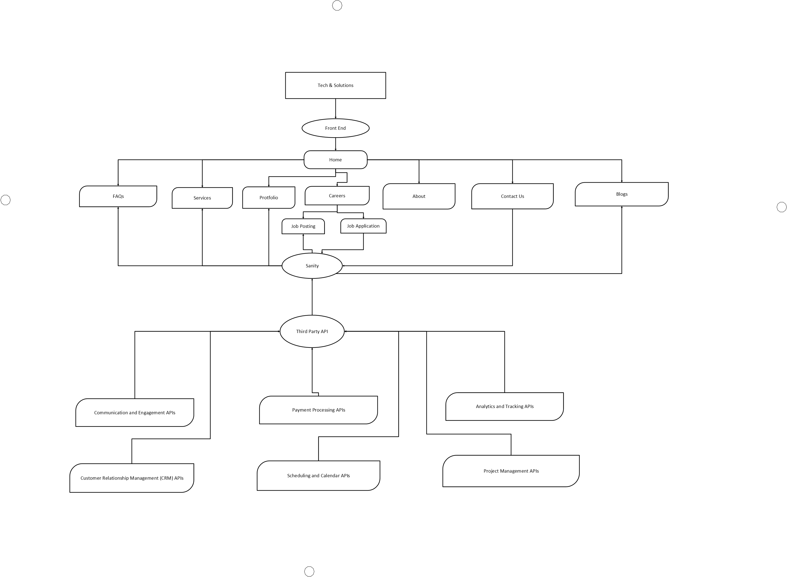
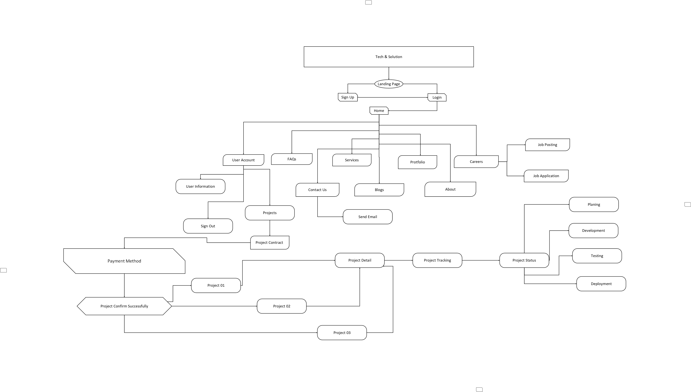

# Market Place Hackathon

Welcome to the **Market Place Hackathon** repository! This project demonstrates a feature-rich marketplace platform with dynamic functionalities and an intuitive user interface. It integrates modern web technologies for an engaging user experience.

---

## Features

- **Dynamic Product Management**: Add, update, and view product details seamlessly.
- **Interactive UI**: Built with Next.js for a responsive and dynamic interface.
- **Third-Party API Integrations**:
  - Payment Gateway Integration for secure transactions.
  - Real-time analytics and user activity tracking.
- **Scalable Content Management**: Powered by Sanity CMS for efficient data handling.
- **Optimized Performance**: Fast-loading pages with efficient resource usage.

---

## System Architecture

### Overview

The system architecture comprises three core components:

1. **Frontend**: Handles user interaction and dynamic content rendering using Next.js.
2. **Sanity CMS**: Manages structured content for products, blogs, and more.
3. **Third-Party APIs**: Enables payment processing, analytics, and other features.

### Diagram



---

## Workflows

### Example Workflow: "User Purchases a Product"

1. **User Interaction**:
   - User browses the marketplace and selects a product.
   - Adds the product to the cart and proceeds to checkout.

2. **Backend Communication**:
   - Fetches product details and stock availability from Sanity CMS.
   - Processes the payment using a third-party API.

3. **Order Completion**:
   - Saves the order details in Sanity CMS.
   - Sends an email confirmation to the user.

### Workflow Diagram



---

## Installation and Setup

### Prerequisites

- **Node.js** (v18 or later)
- **Sanity CLI**
- API keys for third-party integrations (e.g., Stripe, Google Analytics)

### Steps to Run Locally

1. Clone the repository:
   ```bash
   git clone https://github.com/SitesByKashan/Market-Place-Hackathon.git

